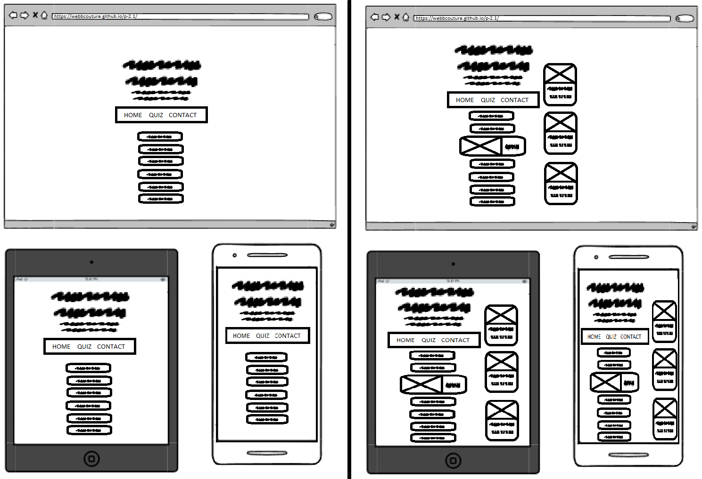
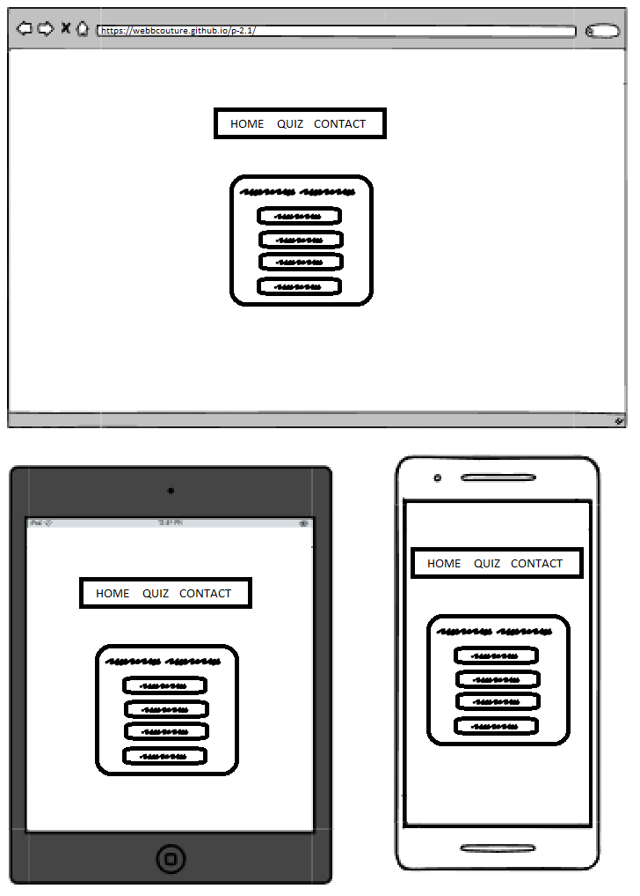
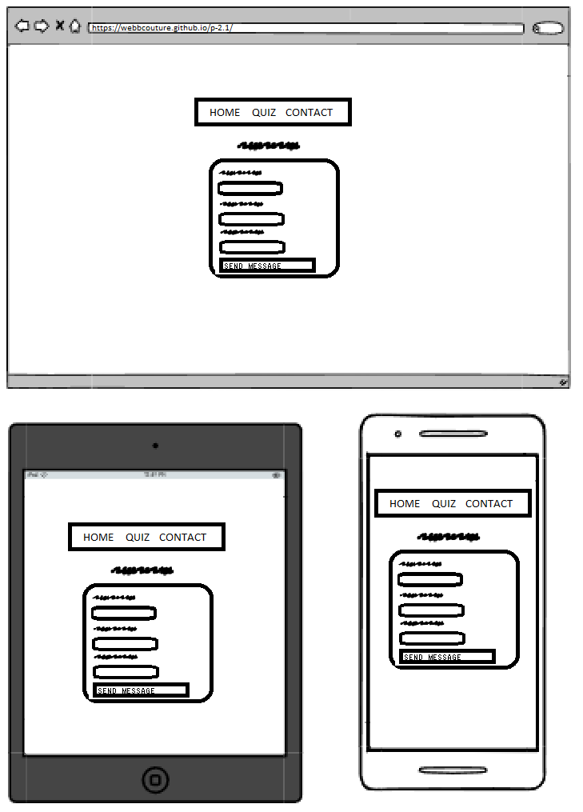
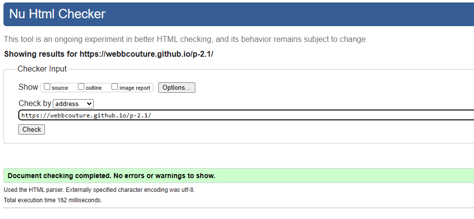
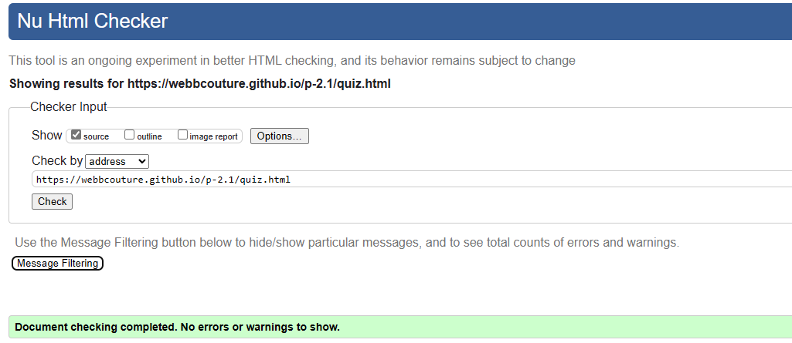
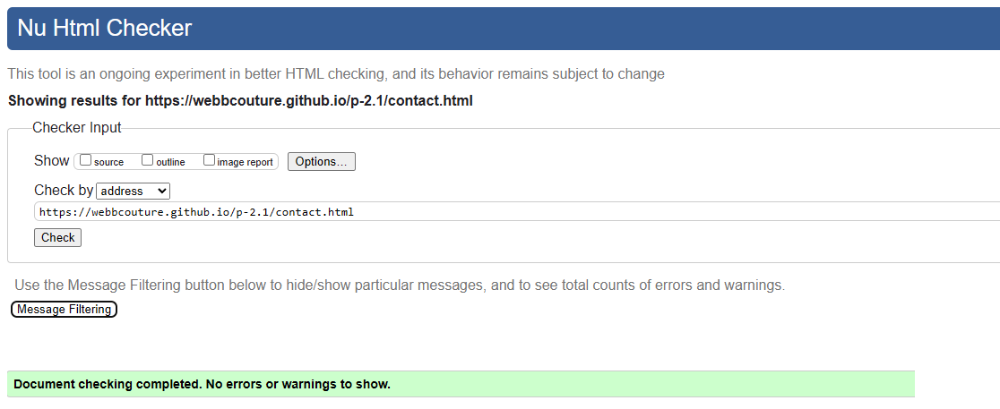

# \:sparkles: Salong Owner Recommendation Site \:sparkles:

View the live project here: [https://webbcouture.github.io/p-2.1/](https://webbcouture.github.io/p-2.1/)


---

## \:clipboard: Project Outline

This project is a use case example of a webpage that can help salon owners find tips on the market's best and affordable wholesalers.

The app project outline is as follows:
**Informed and tips where to go for best Purchases for Customers:** Enhancing customer value by providing detailed product information and recommendations.
**Interactive and User-Centric Design:** Creating a user-friendly experience for e-commerce stores/websites to improve recommendations and categorization.
**Seamless Product Categorization:** Streamlining product categorization to help customers find specific tips for particular purposes, catering to the needs of the best and affordable wholesalers in general.

### \:mag\_right: Project Description:

A webpage that categorizes recommendations of wholesalers for salon owners in one place. You choose the desired category you would like to get tips about and get associated with wholesalers that would have the best desired products.

### \:dart: Project Goals:

The overall goal of the project is to create a website that increases the knowledge of where salon owners can find and buy everything they need for their salon. Since there are so many wholesalers, this webpage makes it easy for salon owners to find good, trustworthy, and affordable wholesalers quickly and easily.

### \:white\_check\_mark: Purpose:

To inform users of the best and affordable wholesalers in one place, categorize those recommendations, and have a seamless user experience. A webpage that could have multiple products/recommendations that can be included in different categories, making it easier for consumers to find exactly what they are looking for and get easy and fast access to the right wholesaler.

## 🎯 Target Symbol: Target Audience:

A page particularly for salon owners who are usually trying to find the best wholesalers easily and quickly. For example, this can be used for a wide range of businesses. In this case, I chose a wholesalers recommendation for salon owners categorized by their specialties in different things that you need when you have a salon.

---

## \:gear: Features

* **Category choice** feature allows you to select a category, like 'Hair products', and return recommendations and tips which give information on specific wholesalers that have a variety of different products and customer services.

* **Updated recommended wholesaler cards**: Recommended wholesaler cards appear only if they are in the index of the associated category part.

* **Highlighting body part category chosen**:
  The first solution I chose to make this feature was simply highlighting the box by changing the box colors on the active class when clicked and keeping the structure of the box selection unchanged.

Then I decided to add to the feature and make a transition effect to make the box larger when clicked. The box once clicked changes to the active CSS class, which has a different flex property than the box class before it is clicked; therefore, it has a transition with an ease-in effect.

```css
.box {
  transition: all 700ms ease-in;
}

.box.active {
  flex: 1;
}

.body-parts .box:not(.active) {
  flex: 0.8; /* Shrink non-active boxes */
}
```

* **Responsive design** to allow for a preferred user experience. Body part and recommended wholesaler card containers are made smaller or larger depending on screen size.

---

## \:memo: User Experience

### \:one: First-Time Visitor Goals

* Understand the main purpose of the site quickly.
* Navigate the site easily to find information.
* Locate the info and contact pages effortlessly.
* Learn what the company offers and how to get in touch.

### \:repeat: Returning Visitor Goals

* Quickly access the contact form.
* Find social media links.
* Get in touch to give feedback or ask questions.

### \:three: Frequent User Goals

* As a Frequent User, want to find the company's contact on WhatsApp easily, to call or text them.

---

## \:bookmark\_tabs: Table of Contents

* [Project Outline](#project-outline)
* [User Experience](#user-experience)
* [Features](#features)
* [Technologies Used](#technologies-used)
* [Wireframes](#wireframes)
* [How Features Support User Stories](#how-features-support-user-stories)
* [Known Bugs](#known-bugs)
* [Browser Compatibility Testing](#browser-compatibility-testing)
* [Form Validation Test Cases](#form-validation-test-cases)
* [Cloning and Forking Instructions](#cloning-and-forking-instructions)
* [Testing](#testing)
* [Testing Table for Body Health App](#testing-table-for-body-health-app)
* [Deployment](#deployment)
* [Credits](#credits)
* [Media](#media)

---

## \:art: Design Section

While you talk about layout and structure, there is no dedicated design section discussing:

* **Color Scheme:** The categories and boxes are styled visually with a consistent color palette that complements the website's theme. Different category boxes are highlighted with a larger box effect when clicked.

* **Typography Choices:** The font is chosen for clarity and ease of reading. Headings are bold, and body text is kept simple and legible to create an inviting user experience.

* **Layout Rationale:** The layout is designed to be clean and easy to navigate, with an interactive design that makes it simple for users to select categories and view recommendations quickly.

---

## \:triangular\_ruler: Wireframes

WebCouture includes Balsamiq wireframe images. Your README doesn’t mention wireframes or planning visuals. Below are the wireframe links for the homepage and category pages.

* \[Homepage Wireframe]\(ADD LINK)
* \[Category Page Wireframe]\(ADD LINK)

Home - Page one:



Quiz - page 2:



Contact - page 3:



---

## \:wrench: Technologies Used

* **HTML, CSS, JS**: These are the core technologies used to build the website.
* **Font Awesome**: Icons used for a cleaner and more interactive design.
* **GitHub, Git**: Version control used for the project’s development.
* **Balsamiq**: Wireframing tool used to plan the project’s structure.

---

## \:books: How Features Support User Stories

* **Category Selection**: Supports the goal of first-time visitors by making it easy for them to navigate and find information.
* **Updated Wholesaler Cards**: Helps returning visitors by showing them relevant products and offers based on previously selected categories.
* **Responsive Design**: Ensures a seamless experience across various devices for frequent users, enhancing usability for them.

---

## \:bug: Known Bugs

* High payload from JS script delays the loading of Beauty card content. Further optimization of the script is required to improve loading times.

---

## \:computer: Browser Compatibility Testing

* **Chrome, Firefox, Safari**: Tested on these browsers to ensure consistent experience. No issues were found except for minor styling differences on Safari.

---

## \:ballot\_box\_with\_check: HTML Validator Redults

index.html: Valid


quiz.html: Valid


contact.html: Valid


---

## \:inbox\_tray: Cloning and Forking Instructions

1. Fork the repository to your own GitHub account.
2. Clone the repository using `git clone https://github.com/yourusername/p-2.1`.
3. Navigate to the project directory.
4. Run `index.html` in your browser to see the page in action.

---

## \:white\_check\_mark: Testing

* Tested the page on different browsers (Chrome, Firefox, Safari).
* Confirmed that category cards and recommended wholesaler selection panel texts are all readable and easy to understand.
* Tested that the form is clickable and actionable across multiple screen sizes.

---

## \:rocket: Deployment

This section describes the process you went through to deploy the project to a hosting platform (e.g., GitHub).

* The site was deployed to GitHub pages. The steps to deploy are as follows:

  * In my GitHub repository, I navigated to the Settings tab.
  * From the source section drop-down menu, I selected the Master Branch.
  * Once the master branch has been selected, the page automatically refreshed with a detailed ribbon display to indicate the successful deployment.

The live link can be found here: [https://webbcouture.github.io/p-2.1/](https://webbcouture.github.io/p-2.1/)

---

## \:clap: Credits

* **Content**: [Brad Traversy - 50projects50days](https://github.com/bradtraversy/50projects50days/tree/master/content-placeholder)
* **Inspiration from**: [3d-boxes-background - Brad Traversy](https://github.com/bradtraversy/50projects50days/tree/master/3d-boxes-background)

---

## \:camera: Media

Images for the categories were generated using Adobe Firefly AI image generator, ensuring consistency in design, size, and relevance for each category.

* \[Add pic name and from who]\(ADD LINK TO PIC)

---

This updated layout enhances readability and uses symbols to make it more visually engaging, while ensuring everything works perfectly in VS Code!
